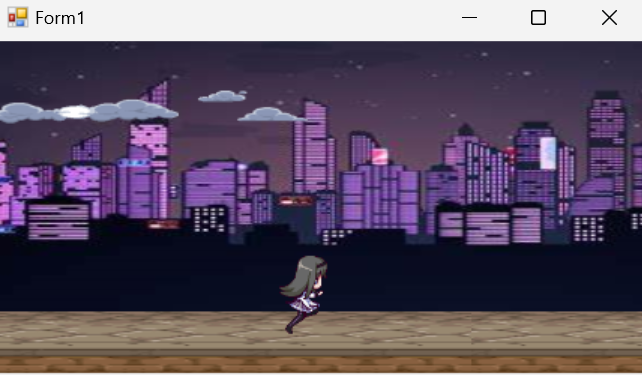
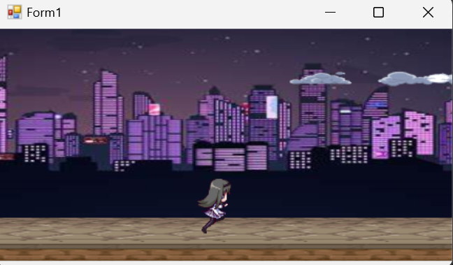
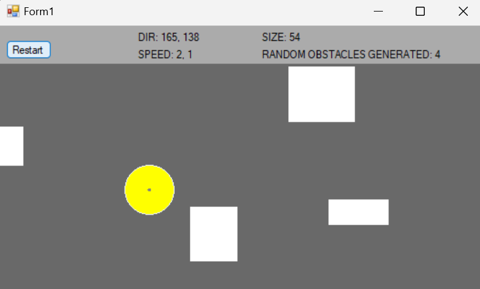
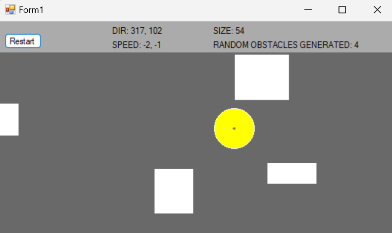

# LaboratorioDeVideojuegos
 Laboratorio de videojuegos UDLAP

## Índice
- [Hola Parallax](#hola-parallax)
- [Collision](#collision)

## Hola Parallax
Se encuentra en la carpeta Parallax y contiene los sprites trabajados en clase pero los que se muestran al correr la aplicación son los que se piden en la tarea, es decir, otros sprites ajustados para que se vean bien.

## Collision
Se encuentra en la carpeta Collision y contiene los sprites trabajados en clase pero los que se muestran al correr la aplicación son los que se piden en la tarea, es decir, otros sprites ajustados para que se vean bien.

