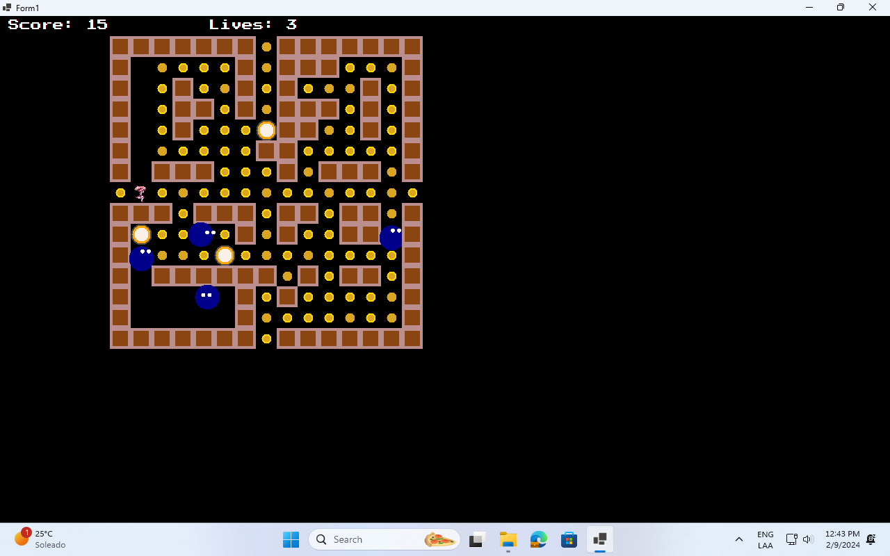
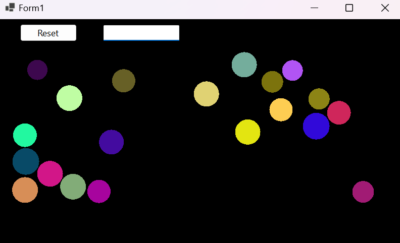
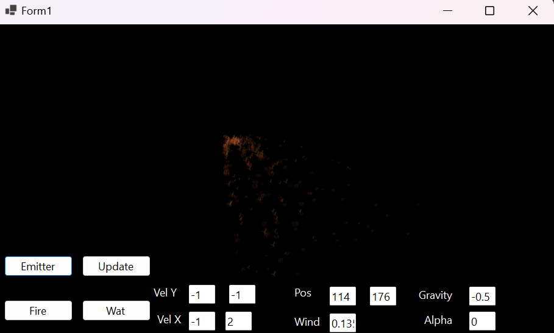
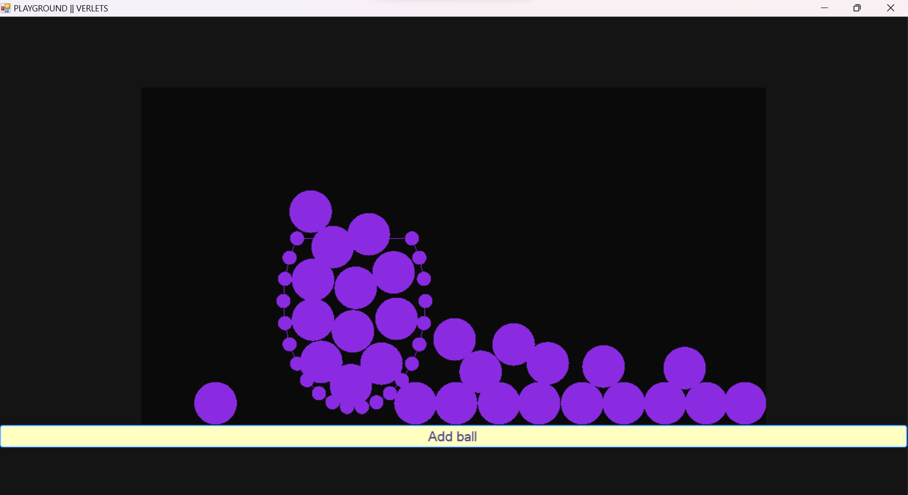
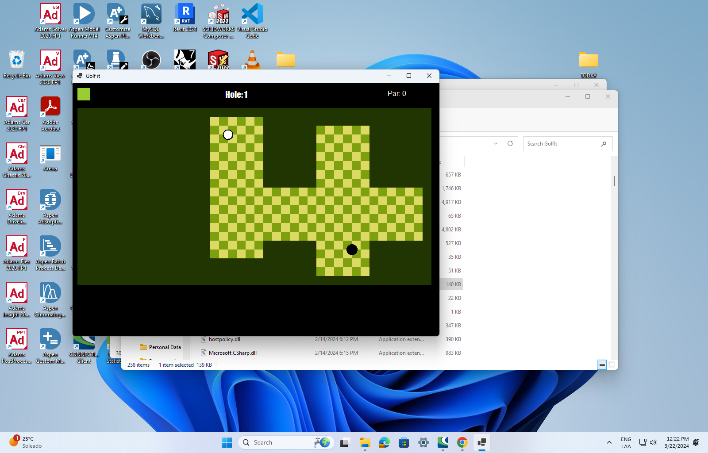

# LaboratorioDeVideojuegos

Laboratorio de videojuegos UDLAP

## Índice

- [Hola Parallax](#hola-parallax)
- [Collision](#collision)
- [Pacman](#pacman)
- [Particle System](#particle-system)
- [Particle System 2](#particle-system-2)
- [Verlet](#verlet)
- [Golf It](#golf-it)

## Hola Parallax

Se encuentra en la carpeta Parallax y contiene los sprites trabajados en clase pero los que se muestran al correr la aplicación son los que se piden en la tarea, es decir, otros sprites ajustados para que se vean bien.

## Collision

Se encuentra en la carpeta Collision y contiene los sprites trabajados en clase pero los que se muestran al correr la aplicación son los que se piden en la tarea, es decir, otros sprites ajustados para que se vean bien.

## Pacman

Se encuentra en la carpeta Pacman y contiene el juego de Pacman. se necesita .NET Core 8.0

## Particle System

Se encuentra en la carpeta Convolusion y contiene el projecto Particle. se necesita .NET Core 8.0

## Particle System 2

Se encuentra en la carpeta ParticlesTwo y contiene el projecto Particle2. se necesita .NET Core 8.0

## Verlet

Se encuentra en la carpeta Verlet y contiene el projecto Verlet. Es para .NET Framework.

## Golf It
Juego de golf en el que el jugador debe meter la pelota en el hoyo con la menor cantidad de golpes posibles. Se encuentra en la carpeta GolfIt y contiene el projecto GolfIt. Es para .NET 8.0

