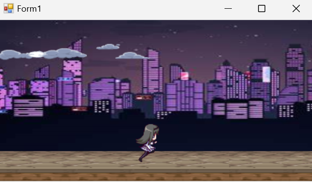
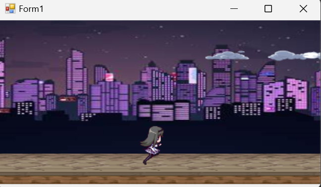

# Parallax RS

A Rust implementation of the Parallax project using raylib-rs.

This project demonstrates a parallax scrolling effect with multiple background layers moving at different speeds, creating a depth illusion. The player character changes sprites based on movement state.

## Demo

Here are screenshots of the game in action:

_Character running with parallax background_

_Character running with active parallax scrolling, moved backgrounds_

## Features

- **Multi-layer parallax scrolling**: 3 background layers moving at different speeds (1, 3, 10 pixels per frame)
- **Player character**: Animated sprite that changes between holding and running states
- **Smooth movement**: Right arrow key controls movement with proper key press/release detection
- **Infinite scrolling**: Background layers wrap around seamlessly

## Controls

- **Right Arrow Key**: Hold to move and activate parallax scrolling
- **ESC**: Close the application

## Original C# Implementation

This is a Rust port of the original C# Windows Forms application, maintaining the same visual behavior and game mechanics while leveraging raylib for cross-platform compatibility and better performance. To view the implementation, view git history to the last [commit](https://github.com/dontloseyourheadsu/LaboratorioDeVideojuegos/commit/0adb795a2cd899edf0c38532ed1aebc5ea85fa8a) that contained the .NET project, Parallax.

## Resources

The `Resources/` folder contains all the sprites and background images:

- `B1.jpg`, `B2.png`, `B3.png`: Background layers
- `HomuraHold.gif`, `HomuraRunning.gif`: Player character sprites

## Build and Run Commands

See the commands section below for building and running the project.
